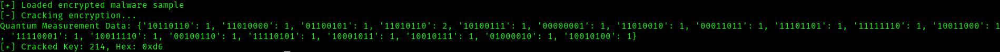
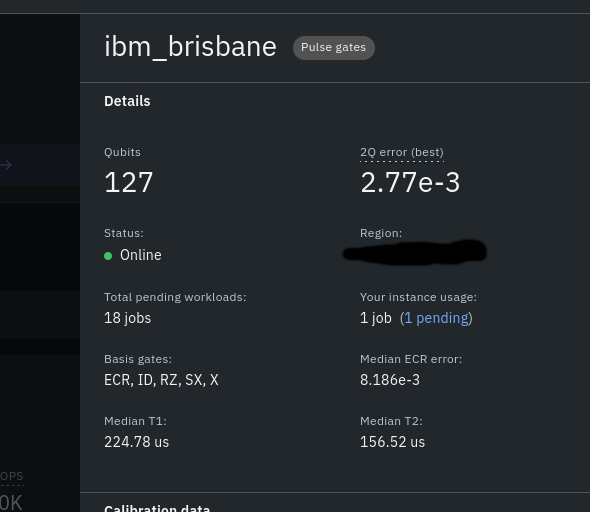

# Exe QUacker

I have changed the script to run on a local simulation instead of on IBM's quantum computers.

This is a rewrite of one of my previous projects for qiskit. I have acutally tested this program on a quantum computer. Quantum Error Correction has not been implemented, instead I increased the amount of times the circuit is run on a quantum computer. I am planning on adding error suppression soon, so the script can run for less time.

# Examples:
Encrypted metasploit windows/x86/reverse_tcp payload (uniform xor encryption)

